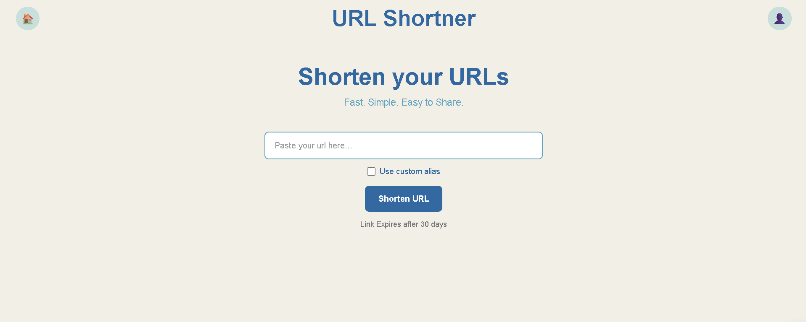
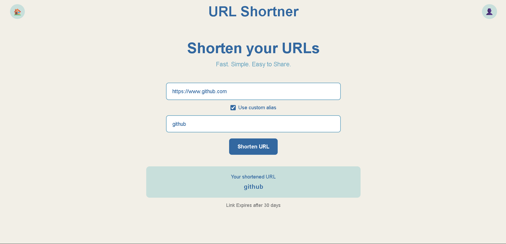
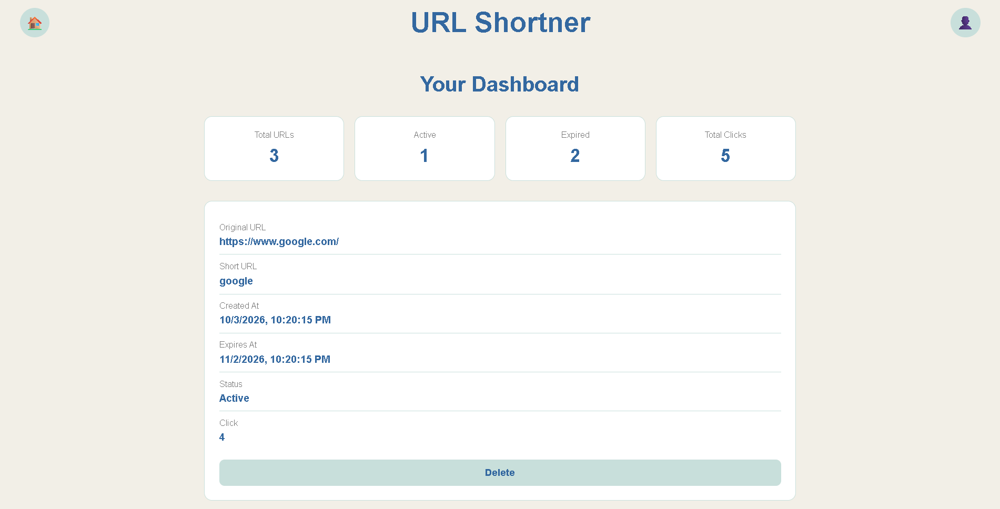
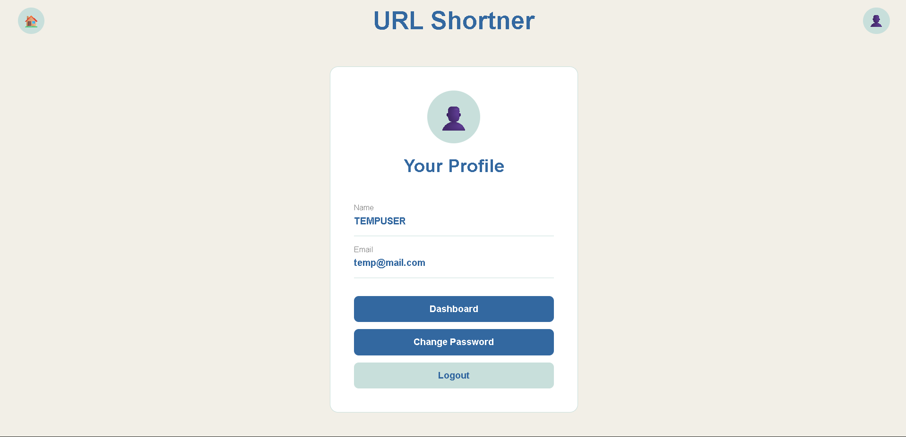
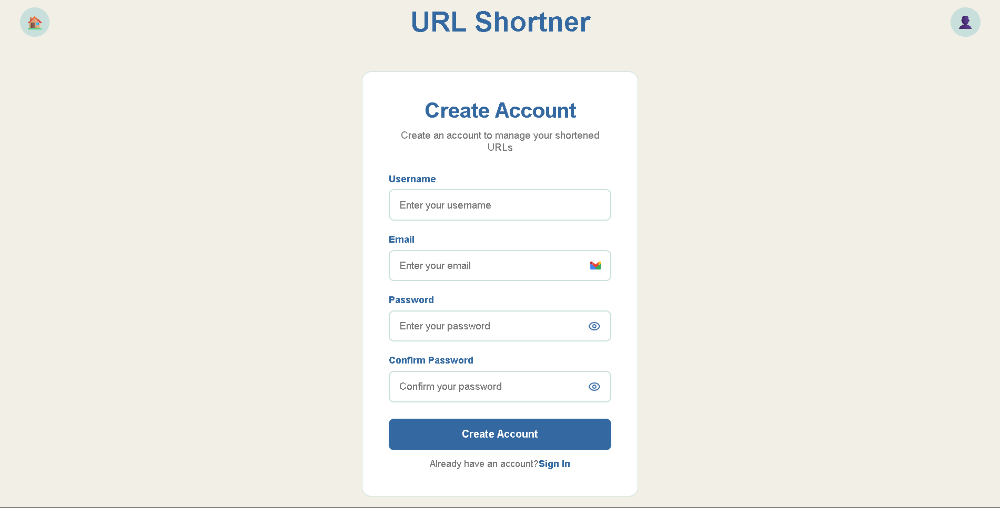
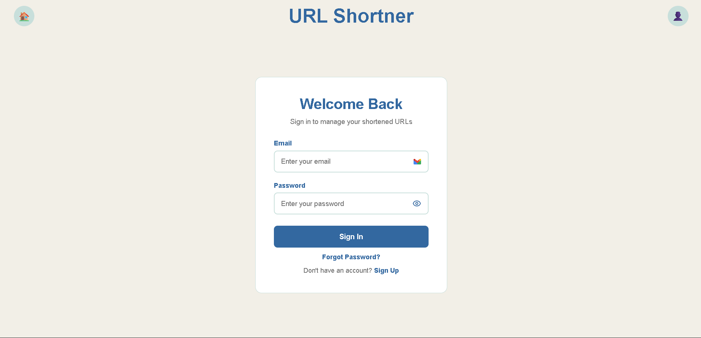
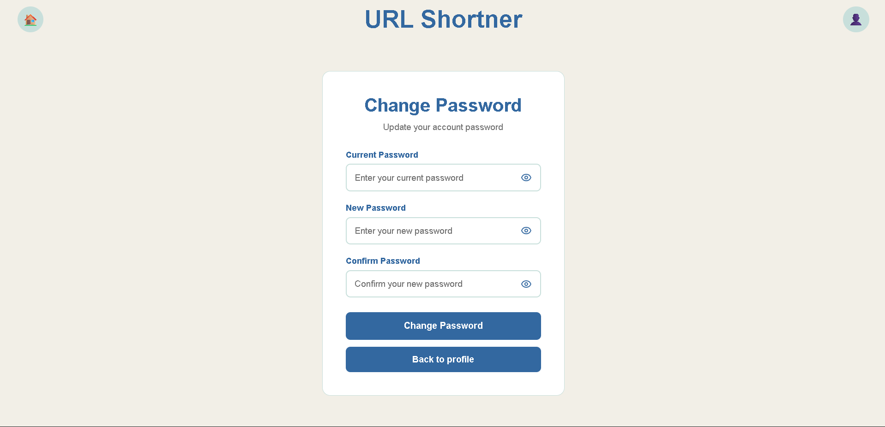

# 🔗 URL Shortener

A full-stack URL shortening application built with **React** and **FastAPI** that allows authenticated users to create, manage, and track shortened URLs.

Users can generate unique short URLs, optionally choose custom aliases, track clicks, manage their URLs through a dashboard, and automatically expire links after 30 days.

## 🖥️ URL Shortening



## 🚀 Live Demo

**Frontend:** https://urlshortener-frontend-1uyh.onrender.com

**Backend API:** https://urlshortener-api-jra0.onrender.com

## ✨ Features

- 🔐 User registration and JWT-based authentication
- 🔗 Create shortened URLs
- ✏️ Custom URL aliases
- ⏳ Automatic 30-day URL expiration
- 📊 Dashboard with URL and click statistics
- 👤 User profile
- 🗑️ Delete shortened URLs
- 🔑 Change password
- 📈 Track total clicks
- 🚫 Maximum of 20 stored URLs per user
- 🔄 Scheduled cleanup of expired URLs
- 📱 Responsive frontend
- ☁️ Deployed frontend and backend


## 🛠️ Tech Stack

### Frontend
- React
- React Router
- Axios
- Custom CSS

### Backend
- FastAPI
- SQLAlchemy
- Pydantic
- JWT Authentication
- pwdlib

### Database
- PostgreSQL
- Alembic

### Deployment & Infrastructure
- Render
- GitHub Actions
- Neon PostgreSQL


## ⚙️ How It Works

1. User creates an account and logs in.
2. The frontend sends the long URL to the FastAPI backend.
3. The backend validates the request and generates a unique short code or validates the requested custom alias.
4. The URL is stored in PostgreSQL with a 30-day expiration time.
5. Visiting the short URL resolves the stored URL.
6. The click count is updated and the user is redirected to the original URL.
7. Users can manage their URLs and view statistics from the dashboard.
8. Expired URLs are periodically removed using a GitHub Actions scheduled job.


## 📁 Project Structure

```text
URLShortner/
│
├── .github/
│   └── workflows/
│       └── cleanup.yml              # Scheduled cleanup of expired URLs
│
├── backend/
│   ├── alembic/
│   │   ├── versions/                # Database migration files
│   │   ├── env.py                   # Alembic configuration
│   │   └── ...
│   │
│   ├── alembic.ini                  # Alembic configuration
│   ├── app.py                       # FastAPI application and API routes
│   ├── auth.py                      # JWT authentication
│   ├── cleanup.py                   # Expired URL cleanup script
│   ├── crud.py                      # Database CRUD operations
│   ├── database.py                  # Database connection and session
│   ├── models.py                    # SQLAlchemy database models
│   ├── schemas.py                   # Pydantic request/response schemas
│   └── requirements.txt             # Backend dependencies
│
├── frontend/
│   ├── src/
│   │   ├── components/
│   │   │   ├── Navbar.jsx
│   │   │   ├── PasswordInput.jsx
│   │   │   ├── Toast.jsx
│   │   │   └── ToastContext.jsx
│   │   │
│   │   ├── pages/
│   │   │   ├── Home.jsx
│   │   │   ├── SignIn.jsx
│   │   │   ├── SignUp.jsx
│   │   │   ├── Profile.jsx
│   │   │   ├── Dashboard.jsx
│   │   │   ├── ChangePassword.jsx
│   │   │   └── ShortUrlRedirect.jsx
│   │   │
│   │   ├── api.js                  # Axios API configuration
│   │   ├── App.jsx                  # Application routes
│   │   ├── main.jsx                 # React entry point
│   │   └── all.css                  # Application styles
│   │
│   ├── package.json                 # Frontend dependencies and scripts
│   └── vite.config.js               # Vite configuration
│
├── .gitignore
└── README.md
```


## 📸 Screenshots

### 🖥️ Home



### 📊 Dashboard



### 👤 Profile



### 📝 Sign Up



### 🔐 Sign In



### 🔑 Change Password

